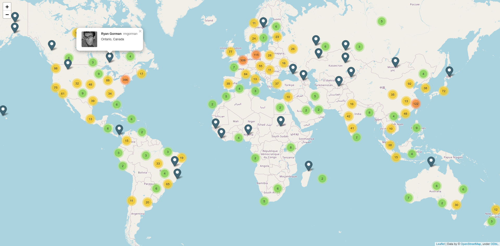

# Stargazer Map

Find out how famous your project is around the world!
```
git clone https://github.com/jonathanhacker/stargazers-map
cd stargazers-map
pip3 install -r requirements.txt
./fetch.py jonathanhacker/stargazers-map
./visualize.py stargazers-map_stargazers.json
firefox map.html
```

`fetch.py` fetches information about every stargazer of the given repository via the Github API and stores it in a json file. This file is then read by `visualize.py`, which looks up all location descriptions on [Nominatim](https://nominatim.openstreetmap.org/search). The resulting coordinates are then displayed on an interactive map using [folium](https://github.com/python-visualization/folium/). Every marker gives information about the respective Github user.



Without authenticating to the Github API you will be limited to 60 requests per hour. To increase this limit to 5000 per hour you can create your own OAuth Token at [https://github.com/settings/tokens/new](https://github.com/settings/token). Put it in your environment to use it (leading space to keep it from being stored in your history):
```
 export GITHUB_TOKEN="<your OAuth-token>"
```

If ratelimiting is applied, `fetch.py` will automatically wait until the limit is reset. Since this can take a while, all progress is stored locally using `shelve`. The script can be interrupted at any time and will not lose any progress. This applies to both the github API requests as well as the Nominatim requests in `visualize.py`.  
As several thousand avatars can be displayed in the map, they are loaded lazily on click.

For an interactive example you can open [example.html](https://github.com/jonathanhacker/stargazers-map/blob/master/example.html) in your browser (caution: 4MB).
